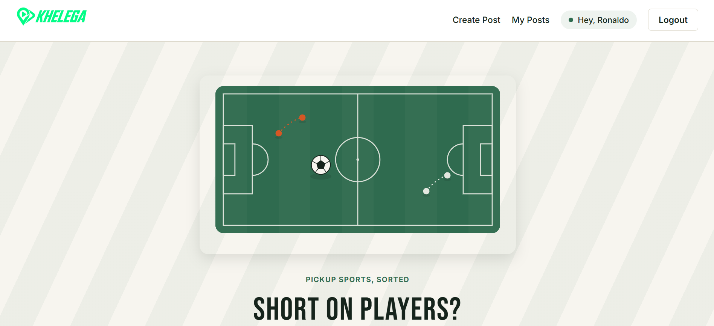
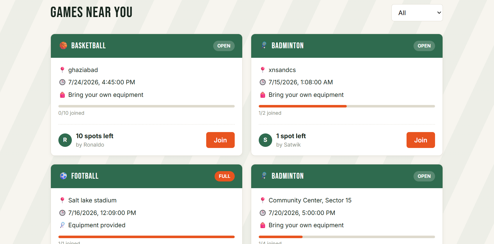
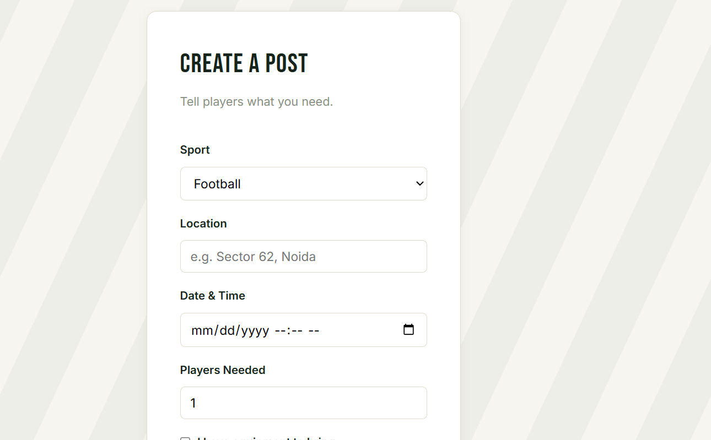

# Khelega 🏏

**Find players. Fill your team. Play more.**

Khelega is a free platform that connects people who want to play a sport but are short on players or equipment. Post what you need — sport, location, time, and how many players are missing — and nearby players can discover and join. No turf booking, no payments, just player-to-player matchmaking.

**Live app:** [khelega-a-sports-meetup-idea.vercel.app](https://khelega-a-sports-meetup-idea.vercel.app)
**API:** [khelega-backend.onrender.com](https://khelega-backend.onrender.com)

> Note: the backend is hosted on a free tier and may take 30–60 seconds to wake up if it hasn't been used recently.

---

## Screenshots

| Home | Feed | Create Post |
|---|---|---|
|  |  |  |

---

## Features

- User authentication with JWT and hashed passwords
- Create posts specifying sport, location, time, players needed, and equipment availability
- Live address search with real-time geocoding (OpenStreetMap Nominatim) when creating a post
- Interactive map with a location pin on each post's detail page, plus map preview thumbnails on the feed (built with Leaflet — no paid API or API key required)
- Browse and filter open games by sport
- Join or leave a game, with live spot-count updates
- View full post details, including everyone who's joined
- "My Posts" view for games you've created or joined
- Only a post's creator can delete it; only logged-in users can create or join posts

## Tech Stack

**Frontend:** React (Vite), React Router, plain CSS
**Backend:** Node.js, Express, JWT, bcrypt
**Database:** MongoDB (Atlas), Mongoose
**Maps & Geocoding:** Leaflet, OpenStreetMap, Nominatim
**Deployment:** Vercel (frontend), Render (backend)

## Project Structure

```
khelega/
  frontend/    React app (Vite)
  backend/     Express API
  docs/        Data model and development notes
```

## Running Locally

### Prerequisites
- Node.js installed
- A MongoDB Atlas connection string

### Backend

```
cd backend
npm install
```

Create a `.env` file in `backend/`:
```
MONGO_URI=your_mongodb_connection_string
JWT_SECRET=your_secret_key
PORT=5000
```

```
npm run dev
```

### Frontend

```
cd frontend
npm install
```

Create a `.env` file in `frontend/`:
```
VITE_API_URL=http://localhost:5000
```

```
npm run dev
```

The app will be running at `http://localhost:5173`.

## API Overview

| Method | Route | Description | Auth required |
|---|---|---|---|
| POST | `/api/auth/signup` | Create an account | No |
| POST | `/api/auth/login` | Log in, receive a JWT | No |
| GET | `/api/posts` | List all posts | No |
| GET | `/api/posts/:id` | Get a single post | No |
| POST | `/api/posts` | Create a post | Yes |
| PUT | `/api/posts/:id/join` | Join a post | Yes |
| PUT | `/api/posts/:id/leave` | Leave a post | Yes |
| DELETE | `/api/posts/:id` | Delete a post (creator only) | Yes |

## License

This project is for educational and portfolio purposes.
